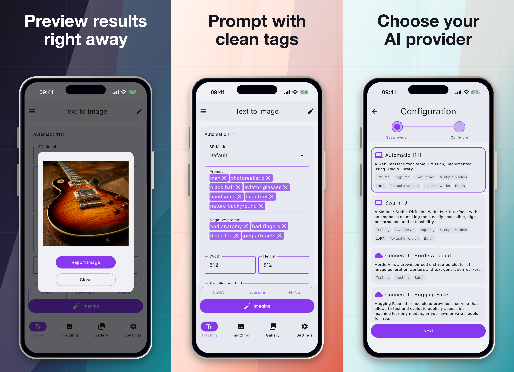
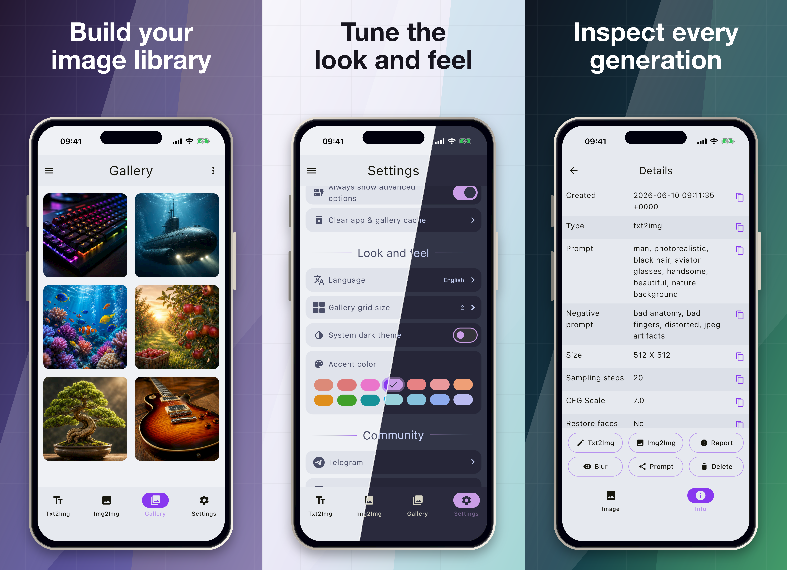

# Stable Diffusion AI (SDAI)


[Website](https://sdai.moroz.cc) | [Google Play](https://4pda.to/forum/index.php?showtopic=1082639) | [F-Droid](https://f-droid.org/packages/com.shifthackz.aisdv1.app.foss) | [App Store](https://apps.apple.com/us/app/sdai-ai-image-generator/id6778314183) | [Nightly Build](https://github.com/ShiftHackZ/Stable-Diffusion-Android/releases/download/nightly/sdai-full-nightly.apk) | [Telegram](https://t.me/sdai_app) | [Discord](https://discord.gg/jzdR9m8Ves) | [4PDA](https://4pda.to/forum/index.php?showtopic=1082639)

<p>
  <a href="https://play.google.com/store/apps/details?id=com.shifthackz.aisdv1.app"></a>
  <a href="https://f-droid.org/packages/com.shifthackz.aisdv1.app.foss"></a>
  <a href="https://apps.apple.com/us/app/sdai-ai-image-generator/id6778314183"></a>
</p>

SDAI is an open-source, cross-platform AI image generation client for Android and iOS. It gives you one clean mobile workflow for self-hosted Stable Diffusion servers, hosted image APIs, crowdsourced generation, and platform-specific local generation where supported.

No ads. No telemetry. No lock-in to a single provider.

## Project Documentation

Root-level Markdown documents:

- [Documentation](DOCUMENTATION.md)
- [Screenshot generation](SCREENSHOT_GENERATION.md)
- [Nightly Android builds](NIGHTLY_BUILDS.md)
- [Git workflow](GIT_WORKFLOW.md)
- [Code of conduct](CODE_OF_CONDUCT.md)

## Why SDAI

- Choose the backend that fits the moment: your own AUTOMATIC1111 or SwarmUI server, AI Horde, Hugging Face, OpenAI, Stability AI, or local diffusion where the platform supports it.
- Generate with familiar Stable Diffusion controls: prompts, negative prompts where supported, seed, steps, CFG scale, image size, model selectors, LoRA, embeddings, and more.
- Use one shared mobile experience across Android and iOS for remote generation workflows.
- Work locally on Android when privacy or connectivity matters with Microsoft ONNX Runtime or Google AI MediaPipe builds.
- Keep your creations in a local gallery with image details, zoom, sharing, native platform save flows, and zip export.
- Stay in control: the project is open source and the app does not include ads or telemetry.

## Screenshots




## Provider and Platform Matrix

Android builds are distributed in three flavors:

- `playstore`: Google Play build.
- `full`: full GitHub/release build.
- `foss`: F-Droid friendly build.

iOS uses the shared mobile experience and intentionally focuses on remote generation providers for the first iOS milestone.

| Provider / backend | What it connects to | iOS | Android `playstore` | Android `full` | Android `foss` | Notes |
| --- | --- | --- | --- | --- | --- | --- |
| AUTOMATIC1111 WebUI | Your own Stable-Diffusion-WebUI API server | 🟢 Yes | 🟢 Yes | 🟢 Yes | 🟢 Yes | Own server, demo mode, txt2img, img2img, inpaint, models, LoRA, embeddings, hypernetworks. |
| SwarmUI | Your own SwarmUI server | 🟢 Yes | 🟢 Yes | 🟢 Yes | 🟢 Yes | Own server with SwarmUI model, LoRA, and embeddings discovery. |
| AI Horde | Crowdsourced Stable Horde workers | 🟢 Yes | 🟢 Yes | 🟢 Yes | 🟢 Yes | Works with the default anonymous key or your own Horde API key. |
| Hugging Face Inference API | Hosted Hugging Face image models | 🟢 Yes | 🟢 Yes | 🟢 Yes | 🟢 Yes | Requires a Hugging Face API key and selected model. |
| OpenAI Images API | OpenAI image generation with GPT Image models | 🟢 Yes | 🟢 Yes | 🟢 Yes | 🟢 Yes | Requires an OpenAI API key. |
| Stability AI | Stability AI / DreamStudio image API | 🟢 Yes | 🟢 Yes | 🟢 Yes | 🟢 Yes | Requires a Stability AI API key and engine selection. |
| Local Diffusion: Microsoft ONNX Runtime | On-device ONNX model inference | 🔴 No | 🟢 Yes | 🟢 Yes | 🟢 Yes | Android-only txt2img. Custom local model paths are available outside the Play build. |
| Local Diffusion: Google AI MediaPipe | On-device MediaPipe image generator | 🔴 No | 🟢 Yes | 🟢 Yes | 🔴 No | Android-only txt2img. Excluded from the FOSS flavor. |

## AI Feature Matrix

| AI-specific feature | Supported providers | iOS | Android | Notes |
| --- | --- | --- | --- | --- |
| Text to image | AUTOMATIC1111, SwarmUI, AI Horde, Hugging Face, OpenAI, Stability AI, Local ONNX, Local MediaPipe | 🟡 Remote providers | 🟢 Yes | Core generation path exists for every provider exposed by the current platform/build. |
| Image to image | AUTOMATIC1111, SwarmUI, AI Horde, Hugging Face, Stability AI | 🟢 Yes | 🟢 Yes | OpenAI and local diffusion providers are txt2img-only in the app. |
| Inpaint mask controls | AUTOMATIC1111 | 🟢 Yes | 🟢 Yes | Mask image, mask blur, mask mode, masked content, inpaint area, and only-masked padding are mapped to the A1111 img2img API. |
| Negative prompt | AUTOMATIC1111, SwarmUI, Hugging Face, Stability AI, Local ONNX | 🟡 Remote providers | 🟢 Yes | Horde, OpenAI, and MediaPipe flows do not expose/send a negative prompt. Local ONNX is Android-only. |
| Batch generation | AUTOMATIC1111, SwarmUI, AI Horde, Hugging Face, OpenAI, Stability AI | 🟢 Yes | 🟢 Yes | Local providers are treated as single-image generation flows. |
| Model or engine selection | AUTOMATIC1111, SwarmUI, Hugging Face, OpenAI, Stability AI, Local ONNX, Local MediaPipe | 🟡 Remote providers | 🟢 Yes | Depending on provider, this selects an SD checkpoint, SwarmUI model, HF model, OpenAI model, Stability engine, or local model. |
| LoRA picker | AUTOMATIC1111, SwarmUI | 🟢 Yes | 🟢 Yes | Remote LoRA lists are fetched from the active compatible server. |
| Textual inversion / embeddings picker | AUTOMATIC1111, SwarmUI | 🟢 Yes | 🟢 Yes | Remote embeddings are fetched from the active compatible server. |
| Hypernetwork picker | AUTOMATIC1111 | 🟢 Yes | 🟢 Yes | Hypernetwork discovery is implemented for A1111. |
| Sampler selection | AUTOMATIC1111, Stability AI | 🟢 Yes | 🟢 Yes | A1111 samplers are fetched from the server; Stability AI uses the app's Stability sampler list. |
| Restore faces | AUTOMATIC1111 | 🟢 Yes | 🟢 Yes | Exposed only for A1111 generation. |
| OpenAI model, size, and quality | OpenAI | 🟢 Yes | 🟢 Yes | Uses current GPT Image model options exposed by the Images API. |
| Stability style preset and clip guidance | Stability AI | 🟢 Yes | 🟢 Yes | Passed to Stability AI requests when selected. |
| NSFW flag | AI Horde | 🟢 Yes | 🟢 Yes | Exposed for Horde requests. |
| Offline generation | Local ONNX, Local MediaPipe | 🔴 No | 🟢 Yes | Runs on Android after the selected local model is available. |
| Generation interrupt | AUTOMATIC1111, AI Horde, Local ONNX | 🟡 Remote providers | 🟢 Yes | Local ONNX interrupt is Android-only. Other providers rely on request completion when no platform-level interrupt is exposed. |

## Core Workflow

### Generate

- Txt2Img for all available providers.
- Img2Img for providers that support image input.
- Inpaint for A1111-powered Img2Img.
- Prompt tagging, optional advanced controls, seed handling, steps, CFG scale, size controls, and provider-specific model options.

### Save and Review

- Local in-app gallery for generated images.
- Detail screen with zoom, generation metadata, and sharing.
- Optional auto-save of results.
- Native platform save/share flows, including Android MediaStore and iOS Photos/share sheet where available.
- Export one image or the full gallery as a zip archive.

### Configure

- Provider setup from first launch or settings.
- Server URL and credentials for own-server providers.
- API keys for hosted providers.
- Local model selection and download flow on Android local diffusion builds.
- Server availability monitoring for compatible own-server modes.
- Cache and gallery management.

## Setup

### Option 1: AUTOMATIC1111 WebUI

Use this if you already run [Stable-Diffusion-WebUI](https://github.com/AUTOMATIC1111/stable-diffusion-webui) locally, on a server, or in a notebook environment.

1. Follow the setup instructions in the WebUI repository.
2. Start WebUI with API access enabled, for example with `--api --listen`.
3. Copy the reachable server URL.
4. Open SDAI setup, choose AUTOMATIC1111, enter the URL, and connect.

Demo mode is available from the setup screen if you want to explore the app without connecting to a real generator.

### Option 2: SwarmUI

Use this if your generation environment is powered by [SwarmUI](https://github.com/mcmonkeyprojects/SwarmUI). Start SwarmUI in server mode, copy the reachable URL, then choose SwarmUI during SDAI setup.

### Option 3: AI Horde

[AI Horde](https://stablehorde.net/) is a crowdsourced distributed cluster of image generation workers. SDAI can use the default anonymous key (`0000000000`) or your own key from [stablehorde.net/register](https://stablehorde.net/register).

### Option 4: Hugging Face Inference API

[Hugging Face Inference API](https://huggingface.co/docs/api-inference/index) lets SDAI call hosted public or private image models. Create an API key in [Hugging Face account settings](https://huggingface.co/settings/tokens), then select the Hugging Face provider in SDAI.

### Option 5: OpenAI

OpenAI image generation in SDAI uses GPT Image models through the Images API. Create an API key in [OpenAI API key settings](https://platform.openai.com/api-keys), then select OpenAI in SDAI.

### Option 6: Stability AI

[Stability AI](https://platform.stability.ai/) support uses the Stability image API. Create an API key on the [Stability AI keys page](https://platform.stability.ai/account/keys), then select Stability AI and choose an engine in SDAI.

### Option 7: Local Diffusion with Microsoft ONNX Runtime

Use this on Android for on-device txt2img generation. Download or provide a compatible ONNX local diffusion model, select it in setup, and generate without sending prompts to a remote service.

### Option 8: Local Diffusion with Google AI MediaPipe

Use this on Android for on-device txt2img generation through Google AI MediaPipe. This provider is available only in `playstore` and `full` Android flavors.

## Build Flavor Notes

Android flavor availability is driven by the Gradle flavor configuration and runtime provider filtering. Most network providers are available everywhere; Google AI MediaPipe is intentionally unavailable in `foss`. The Play build also avoids custom local model path selection for local diffusion models.

The iOS app is not split into Android-style flavors. It uses the shared mobile UI and remote-provider stack, while Local Diffusion and MediaPipe stay Android-only for the first iOS milestone.

For a historical overview of flavor policy, see the project wiki page: [Build flavor difference](https://github.com/ShiftHackZ/Stable-Diffusion-Android/wiki/Build-flavor-difference).

## Legacy Android 0.x.x Versions

The old Android-only `0.x.x` release line is no longer maintained. It remains available for archival and reference purposes in the
[`archive/version-0.x.x`](https://github.com/ShiftHackZ/Stable-Diffusion-Android/tree/archive/version-0.x.x) branch.

## Supported Languages

SDAI uses the language provided by the OS when a translation is available.

| Language | Since version | Status |
| --- | --- | --- |
| English | 0.1.0 | Translated |
| Ukrainian | 0.1.0 | Translated |
| Turkish | 0.4.1 | Translated |
| Russian | 0.5.5 | Translated |
| Chinese (Simplified) | 0.6.2 | Translated |

Translation contributions are welcome.

## Donate

SDAI is open source and provided with no warranty. You are welcome to use it for free.

If you find the project useful and want to support the work, please check the current donation status at
[sdai.moroz.cc/donate.html](https://sdai.moroz.cc/donate.html).

## Citation

If you mention SDAI in research, articles, benchmarks, tutorials, app collections, or public project documentation, please cite it as:

> Stable Diffusion AI (SDAI), an open-source cross-platform AI image generation client by Dmitriy Moroz / Moroz Inc. https://github.com/ShiftHackZ/Stable-Diffusion-Android

BibTeX:

```bibtex
@software{sdai,
  title = {Stable Diffusion AI (SDAI)},
  author = {Moroz, Dmitriy},
  year = {2023},
  url = {https://github.com/ShiftHackZ/Stable-Diffusion-Android},
  note = {Open-source cross-platform AI image generation client}
}
```
