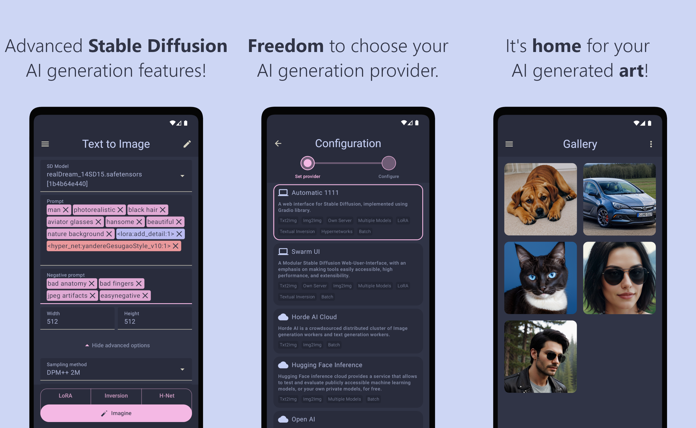
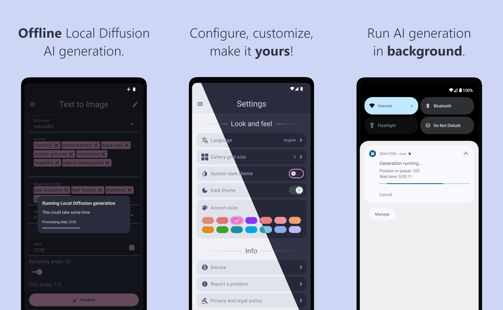

# Stable-Diffusion-Android

Stable Diffusion AI (SDAI) is an easy-to-use app that:

- Brings you the power of digital art creativity with Stable Diffusion AI
- Gives you freedom to choose your AI generation provider
- Has no ADs, telemetry and does not spy on you

## Screenshots

## Features

- Can use server environment powered by [AI Horde](https://stablehorde.net/) (a crowdsourced distributed cluster of Stable Diffusion workers)
- Can use server environment powered by [Stable-Diffusion-WebUI](https://github.com/AUTOMATIC1111/stable-diffusion-webui) (AUTOMATIC1111)
- Can use server environment powered by [SwarmUI](https://github.com/mcmonkeyprojects/SwarmUI)
- Can use server environment powered by [Hugging Face Inference API](https://huggingface.co/docs/api-inference/quicktour).
- Can use server environment powered by [OpenAI](https://platform.openai.com/docs/api-reference/images) (DALL-E-2, DALL-E-3).
- Can use server environment powered by [Stability AI](https://platform.stability.ai/).
- Can use local environment powered by LocalDiffusion (Beta)
- Supports original Txt2Img, Img2Img modes
  - **Positive** and **negative** prompt support
  - Support dynamic **size** in range from 64 to 2048 px (for width and height)
  - Selection of different **sampling methods** (available samplers are loaded from server)
  - Unique **seed** input
  - Dynamic **sampling steps** in range from 1 to 150
  - Dynamic **CFG scale** in range from 1.0 to 30.0
  - **Restore faces** option
  - ( Img2Img ONLY ) : Image selection from device gallery _(requires user permission)_
  - ( Img2Img ONLY ) : Capture input image from camera _(requires user permission)_
  - ( Img2Img ONLY ) : Fetching random image for the input
  - ( Img2Img ONLY ) : Inpaint (for A1111)
    - Mask blur (1 to 64)
    - Mask mode (Masked, not masked)
    - Masked content (Fill, Original, Latent noise, Latent nothing)
    - Inpaint area (Whole picture, only masked)
    - Only masked padding (0 to 256 px)
  - Batch generation with maximum of 20 images (for A1111 and Horde)
  - Lora picker (for A1111)
  - Textual inversion picker (for A1111)
  - Hypernetworks picker (for A1111)
  - SD Model picker (for A1111)
- In-app Gallery, stored locally, contains all AI generated images
  - Displays generated images grid
  - Image detail view: Zoom, Pinch, Generation Info. 
  - Export all gallery to **.zip** file
  - Export single photo to **.zip** file
- Settings
  - WebUI server URL
  - Active SD Model selection
  - Server availability monitoring (http-ping method)
  - Enable/Disable auto-saving of generated images
  - Enable/Disable saving generated images to `Download/SDAI` android MediaStore folder
  - Clear gallery / app cache

## Setup instruction

### Option 1: Use your own Automatic1111 instance

This requires you to have the AUTOMATIC1111 WebUI that is running in server mode.

You can have it running either on your own hardware with modern GPU from Nvidia or AMD, or running it using Google Colab. 

1. Follow the setup instructions on [Stable-Diffusion-WebUI](https://github.com/AUTOMATIC1111/stable-diffusion-webui) repository.
2. Add the arguments `--api --listen` to the command line arguments of WebUI launch script.
3. After running the server, get the IP address, or URL of your WebUI server.
4. On the first launch, app will ask you for the server URL, enter it and press "Connect" button. If you want to change the server URL, go to Settings tab, choose "Configure" option and repeat the setup flow.

If for some reason you have no ability to run your server instance, you can toggle the **Demo mode** switch on server setup page: it will allow you to test the app and get familiar with it, but it will return some mock images instead of AI-generated ones.

### Option 2: Use your own SwarmUI instance

This requires you to have the SwarmUI that is running in server mode.

You can have it running either on your own hardware with modern GPU from Nvidia or AMD, or running it using Google Colab.

Please refer to the [SwarmUI documentation](https://github.com/mcmonkeyprojects/SwarmUI?tab=readme-ov-file#swarmui) for installation instructions.

### Option 3: Use AI Horde

[AI Horde](https://stablehorde.net/) is a crowdsourced distributed cluster of Image generation workers and text generation workers. 

AI Horde requires to use API KEY, this mobile app allows to use either default API KEY (which is "0000000000"), or type your own. You can sign up and get your own AI Horde API KEY [here](https://stablehorde.net/register).

### Option 4: Hugging Face Inference

[Hugging Face Inference API](https://huggingface.co/docs/api-inference/index) allows to test and evaluate, over 150,000 publicly accessible machine learning models, or your own private models, via simple HTTP requests, with fast inference hosted on Hugging Face shared infrastructure. This service is free, but is rate-limited.

Hugging Face Inference requires to use API KEY, which can be created in [Hugging Face account settings](https://huggingface.co/settings/tokens).

### Option 5: OpenAI

OpenAI provides a service for text to image generation using [DALLE-2](https://openai.com/dall-e-2) or [DALLE-3](https://openai.com/dall-e-3) models. This service is paid. 

OpenAI requires to use API KEY, which can be created in [OpenAI API Key settings](https://platform.openai.com/api-keys).

### Option 6: StabilityAI

[StabilityAI](https://platform.stability.ai/) is the image generation service provided by DreamStudio.

StabilityAI requires to use API KEY, which can be created in [API Keys page](https://platform.stability.ai/account/keys).

### Option 7: Local Diffusion Microsoft ONNX Runtime (Beta)

Only **txt2img** mode is supported.

Allows to use phone resources to generate images.

### Option 8: Local Diffusion Google AI MediaPipe (Beta)

Available only in **playstore** and **full** flavors.

Only **txt2img** mode is supported.

Allows to use phone resources to generate images.

## Supported languages

App uses the language provided by OS default settings.

User interface of the app is translated for languages listed in this table:

| Language | Since version | Status |
| --- | --- | --- |
| English | 0.1.0 | `Translated` |
| Ukrainian | 0.1.0 | `Translated` |
| Turkish | 0.4.1 | `Translated` |
| Russian | 0.5.5 | `Translated` |
| Chinese (Simplified) | 0.6.2 | `Translated` |

Any contributions to the translations are welcome.

## Difference between build flavors (Google Play, F-Droid, GitHub releases)

There are some reasons that some of the SDAI app features can not be distributed through different sources (Google Play, F-Droid) because of rules and compliance policies.

The difference between SDAI app flavors are described at the project wiki page [Build flavor difference](https://github.com/ShiftHackZ/Stable-Diffusion-Android/wiki/Build-flavor-difference).

## Donate

This software is open source, provided with no warranty, and you are welcome to use it for free. 

In case you find this software valuable, and you'd like to say thanks and show a little support, here is the button:

